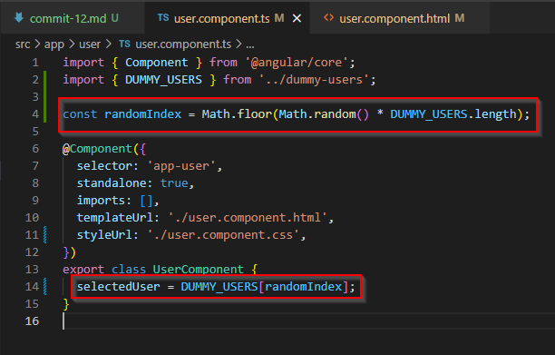
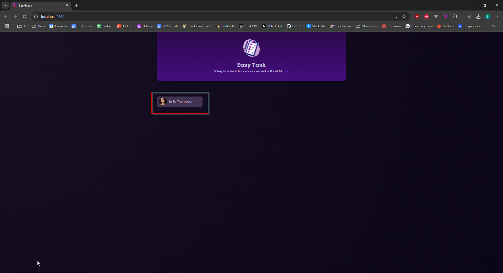

# Commit 12

In this commit, I added a way to draw a random number in the UserComponent and stored that random number in a variable called **_randomIndex_**. I also added an object property whose value is given by passing the randomIndex variable into the DUMMY_USERS array:



## String Interpolation

The purpose of this exercise is to understand what **_string interpolation_** is. String interpolation in Angular is a way of displaying in the template the value of a property from the component. In this case, we are displaying the **_selectedUser_** property in the template of the UserComponent, using double braces that wrap around the property name, like so:

```html
<div>
  <button>
    
    <span>{{ selectedUser.name }}</span>
  </button>
</div>
```

It's important to note here that **_selectedUser_** is an object, so we need to use dot notation to call that object's properties (either the name, the avatar, or the id, as seen in the DUMMY_USERS array file).

## Property Binding

Another way of displaying data in the template of a component is to use what is called **_property binding_**. We can display a user's name in the UserComponent's template by putting brackets around the **_src_** property of the image tag. This binds the **_selectedUser_** object to the image tag, which will then enable us to display the user's name, avatar, or id on the UI:

```html
<div>
  <button>
    
    <span>{{ selectedUser.name }}</span>
  </button>
</div>
```

This is what the site-user would see on the UI:


