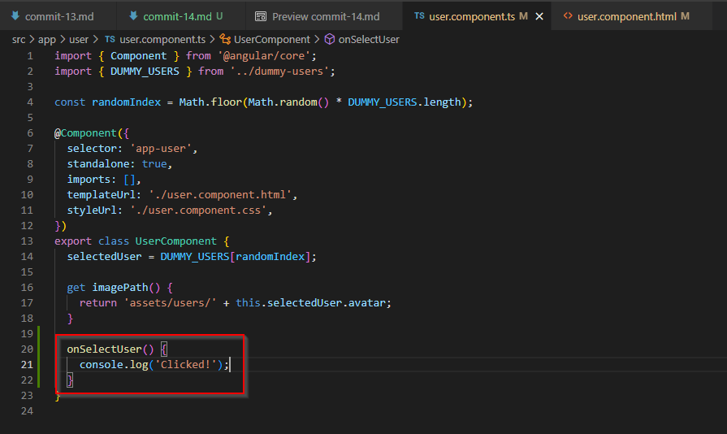
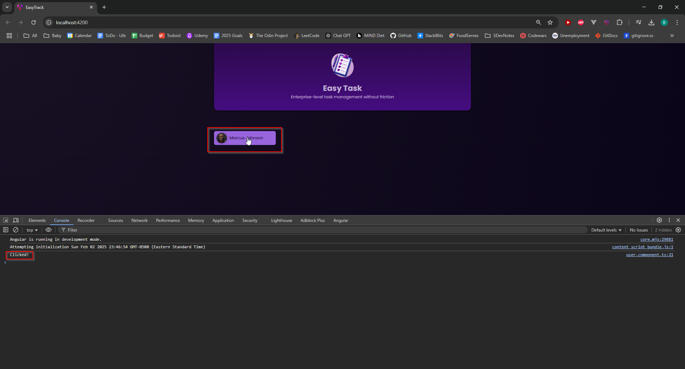

# Commit 14

## Event Listening and Binding

We can add an event listener to an HTML element such as a button by adding the event (in this case, a click event) as an attribute to the button's HTML tag. We set the value of that click event to be some function that we put in the associated component (in this case, the UserComponent). That function can do whatever we want, but for this commit, we'll only have the function logging a string to the console:



And in the template, we set the value of the click event to be the function's name, like so:

```typescript
<div>
  <button (click)="onSelectUser()">
    
    <span>{{ selectedUser.name }}</span>
  </button>
</div>

```

When the site-user clicks on the button on the UI, the console should log the word, "Clicked!":


