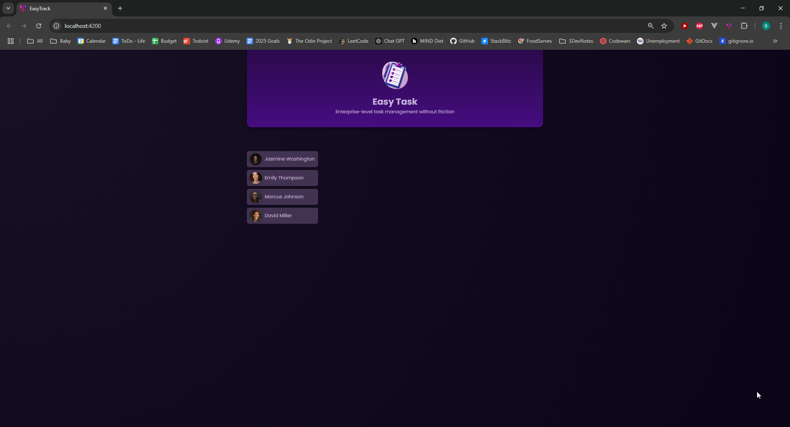

# Commit 16

## Input Decorator

In this commit, I deleted the code for signals for each property in the UserComponent class and instead added an Input Decorator for each property that I want to display in the template of the UserComponent. The @Input() decorator in Angular allows a parent component to pass data to a child component. It's a way to bind values to the child component's properties from outside the child component. In our example, the app component, which is the parent component, now contains the dummy users array, and this data is getting passed to the user component, which is the child component, via Input properties.

Here is the parent component, the AppComponent:

```typescript
import { Component } from "@angular/core";
import { HeaderComponent } from "./header/header.component";
import { UserComponent } from "./user/user.component";
import { DUMMY_USERS } from "./dummy-users";

@Component({
  selector: "app-root",
  standalone: true,
  imports: [HeaderComponent, UserComponent],
  templateUrl: "./app.component.html",
  styleUrl: "./app.component.css",
})
export class AppComponent {
  users = DUMMY_USERS;
}
```

Here, the DUMMY_USERS array is set in this component. The child component, i.e., the UserComponent, will contain the Input() Decorator for each property in the DUMMY_USERS array for each user, like so:

```typescript
import { Component, computed, Input, signal } from "@angular/core";
import { DUMMY_USERS } from "../dummy-users";

const randomIndex = Math.floor(Math.random() * DUMMY_USERS.length);

@Component({
  selector: "app-user",
  standalone: true,
  imports: [],
  templateUrl: "./user.component.html",
  styleUrl: "./user.component.css",
})
export class UserComponent {
  @Input({ required: true }) avatar!: string;
  @Input({ required: true }) name!: string;

  get imagePath() {
    return "assets/users/" + this.avatar;
  }

  onSelectUser() {}
}
```

In this example, the parent component's data gets passed to the child component's data. Now, in the parent component's template, in each child component's HTML element tag, we can have property binding, which binds the input properties in the child component to the data in the parent component:

```html
<app-header></app-header>

<main>
  <ul id="users">
    <li>
      <app-user [avatar]="users[0].avatar" [name]="users[0].name"></app-user>
    </li>
    <li>
      <app-user [avatar]="users[1].avatar" [name]="users[1].name"></app-user>
    </li>
    <li>
      <app-user [avatar]="users[2].avatar" [name]="users[2].name"></app-user>
    </li>
    <li>
      <app-user [avatar]="users[3].avatar" [name]="users[3].name"></app-user>
    </li>
  </ul>
</main>
```

Also added are the "required" properties to each @Input() property, for the purposes of type safety.

At this point, we now have 4 <li> elements, each with a different user, and each of those elements contains the user's avatar and name on the UI. Later on, we will use a structural directive to display the users on the UI:


