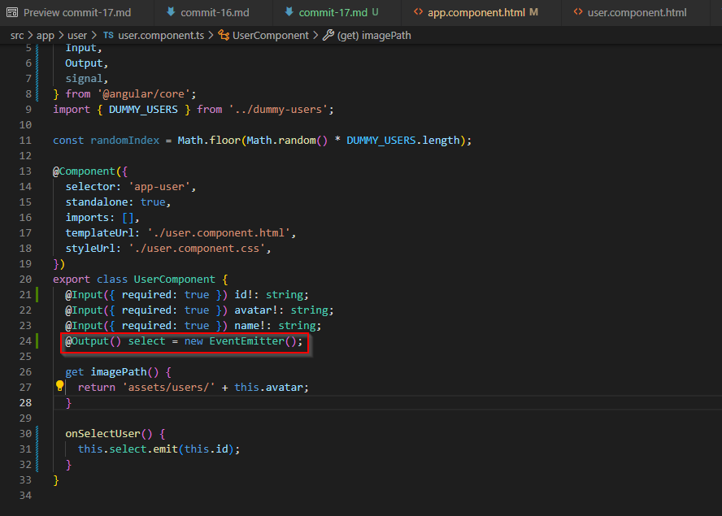
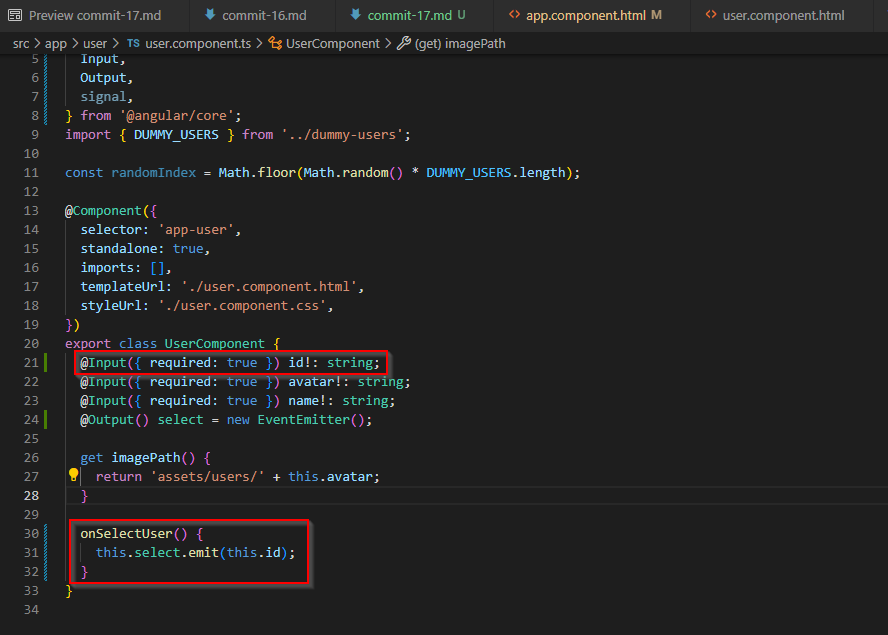

# Commit 17

## Outputs and Event Emitters

In this commit, we focus on output properties and event emitters. We want to select a user by clicking on the button with the user's avatar and name, and have data display next to the user buttons. The data will display in the app component next to the user buttons. In essence what we are doing is outputting user data to the app component from the user component so that the user-specific task information can be displayed next to the user buttons on the UI.

In Angular, if we want to output a property from one component to another component so that latter component can use that property, we instantiate the property variable and decorate it with the **_@Output() Decorator_**, like so:



We create a new EventEmitter object and set it equal to a new property called **_select_**. The EventEmitter object will allow us to emit custom values through the **_select_** property to any parent component that is interested in it (in this case, the AppComponent). We add another property from the array for the dummy users, i.e., the id property, and we can emit that value back to the parent component whenever a user is selected (i.e., when the user button is clicked). We do this via a method that uses the **_select_** property and emits the user's id to the parent component:



We bind this **_onSelectUser()_** method in the UserComponent to the click event handler in the UserComponent template, so that when the user button is clicked, the **_onSelectUser()_** method runs, and an event is emitted:

```html
<div>
  <button (click)="onSelectUser()">
    
    <span>{{ name }}</span>
  </button>
</div>
```

So, we've emitted an event, namely the sending of the user id to another component, but where is the event emitted to? It's emitted to the parent component, in this case the AppComponent and its associated template:

```html
<app-header></app-header>

<main>
  <ul id="users">
    <li>
      <app-user [id]="users[0].id" [avatar]="users[0].avatar" [name]="users[0].name" (select)="onSelectUser($event)"></app-user>
    </li>
    <li>
      <app-user [id]="users[1].id" [avatar]="users[1].avatar" [name]="users[1].name" (select)="onSelectUser($event)"></app-user>
    </li>
    <li>
      <app-user [id]="users[2].id" [avatar]="users[2].avatar" [name]="users[2].name" (select)="onSelectUser($event)"></app-user>
    </li>
    <li>
      <app-user [id]="users[3].id" [avatar]="users[3].avatar" [name]="users[3].name" (select)="onSelectUser($event)"></app-user>
    </li>
  </ul>
</main>
```

Here, the function **_onSelectUser()_** is bound to the **_(select)_** that comes from the child UserComponent, so after the event is fired by clicking the user button, the user id is sent to the parent component's template. The **_($event)_** is the id that gets passed to the **_onSelectUser()_** function, which is in the parent AppComponent:

```typescript
import { Component } from "@angular/core";
import { HeaderComponent } from "./header/header.component";
import { UserComponent } from "./user/user.component";
import { DUMMY_USERS } from "./dummy-users";

@Component({
  selector: "app-root",
  standalone: true,
  imports: [HeaderComponent, UserComponent],
  templateUrl: "./app.component.html",
  styleUrl: "./app.component.css",
})
export class AppComponent {
  users = DUMMY_USERS;

  onSelectUser(id: string) {
    console.log("Selected user with id " + id);
  }
}
```

The id gets passed to the **_onSelectUser()_** method, the method executes, and for now, all that happens is that a message with the id is logged to the console.

## Binding

**_Binding_** is the act of creating a connection between the view and the model (i.e., the template and the component).

There are different kinds of binding in Angular:

1. Text (string) interpolation

- Syntax: {{ expression }} - using double curly braces
- Used to bind data from the component to the template.
- Angular evaluates the expression inside the curly braces and inserts the result as a string.
- Commonly used for displaying dynamic data in the view.

```html
<p>Hello, {{ userName }}!</p>
```

If the **_userName = 'Brad'_**, then the template will render:
**_Hello, Brad_**

2. Property binding

- Syntax: [property]="expression"
- Binds values from the component to an element’s property.
- Typically used for dynamic settings of HTML properties, such as disabling a button or setting an image source.

```html
 <button [disabled]="isButtonDisabled">Click me</button>
```

If **_profileImageUrl = 'assets/user.jpg'_** and **_isButtonDisabled = true_**,
the image will render on the UI, and the button will be disabled.

3. Event binding

- Syntax: (event)="handlerFunction($event)"
- Listens for events from the user, such as clicks, input changes, or form submissions, and calls a function in the component.

In the template:

```html
<button (click)="onClick()">Click me</button> <br />
<input (input)="onInputChange($event)" placeholder="placeholder text" />
```

In the component:

```typescript
onClick() {
  console.log('Button clicked!');
}

onInputChange(event: any) {
  console.log('User input:', event.target.value);
}

```

4. Two-way binding

- Syntax: [(ngModel)]="property"
- Synchronizes data between the component and the view.
- Changes in the input element update the component property, and vice versa.
- Requires importing FormsModule in AppModule.

```html
<input [(ngModel)]="userName" placeholder="Enter your name" />
<p>Hello, {{ userName }}!</p>
```

If **_userName = 'Brad'_**, the input box will show "Brad," and any changes to the input will immediately reflect in the paragraph.

| **Binding Type**   | **Direction**    | **Use Case**                    |
| ------------------ | ---------------- | ------------------------------- |
| Text Interpolation | Component → View | Display dynamic content         |
| Property Binding   | Component → View | Set element properties          |
| Event Binding      | View → Component | Handle user interactions        |
| Two-Way Binding    | View ↔ Component | Sync form input with properties |
