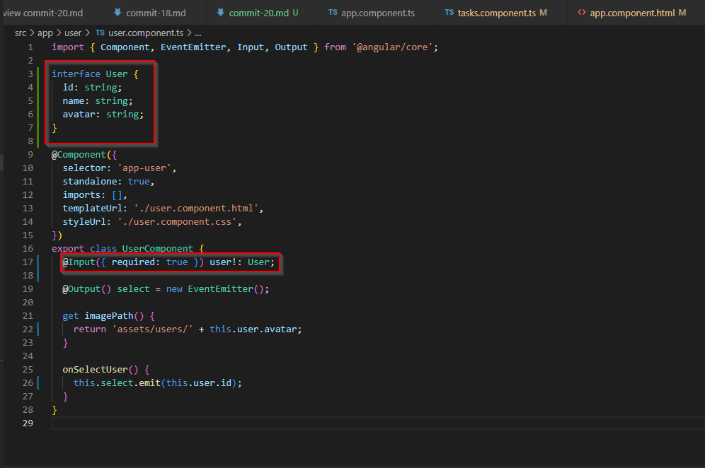

# Commit 20

In this commit, I changed the input properties in UserComponent so that we are inputting a user interface object with id, name, and avatar properties, instead of those properties as input properties individually. Update template and component code where appropriate after making these changes.



I also updated the AppComponent template to add a for loop to loop through each app user instead of being hard-coded so that they are displayed on the UI. I then added an if/else conditional in the AppComponent template to display a string value if the value of **_selectedUser_** is null.

```html
<app-header></app-header>

<main>
  <ul id="users">
    @for (user of users; track user.id) {
    <li>
      <app-user [user]="user" (select)="onSelectUser($event)"></app-user>
    </li>
    }
  </ul>
  @if (selectedUser) {
  <app-tasks [name]="selectedUser.name"></app-tasks>
  } @else {
  <p id="fallback">Select a user to see their tasks.</p>
  }
</main>
```
