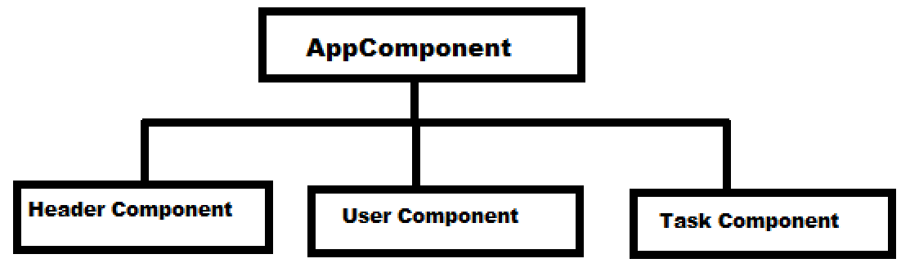

# Commit 8

## Boostrapping the Application

In the main.ts file, there is a function that accepts the AppComponent as a parameter. This function is named bootstrapApplication():

```typescript
import { bootstrapApplication } from "@angular/platform-browser";

import { AppComponent } from "./app/app.component";

bootstrapApplication(AppComponent).catch((err) => console.error(err));
```

The function takes the AppComponent as a parameter and looks for its selector in the index.html file, which is the one entitled <app-root>:


It will replace the <app-root> element tag with the HTML that is stored in the template that is associated with the AppComponent, i.e., the app-component.html file:


Here, we see what the user will see when they navigate to the site:


## Header

Added a header component, template, and style sheet. This component is situated at the top of the web page for each page in the application.

To create this component and its associated files, I used a git command in the CLI:

```git
ng g c 'component-name'

```

Specifically, to create the header component, I changed the 'component-name' to 'header':

```git
ng g c header --skip-tests

```

This command created the header component, the header template, and the header style sheet. I decided to skip tests for now because I can always add them later.

The following is what was made when the header component files were created:

```typescript
import { Component } from "@angular/core";

@Component({
  selector: "app-header",
  standalone: true,
  imports: [],
  templateUrl: "./header.component.html",
  styleUrl: "./header.component.css",
})
export class HeaderComponent {}
```

The **_standalone_** property in the Component decorator is something that was added to Angular in version 16. Before version 16, Angular was module-based, so you would have an AppModule that contained imported references for all the components in your app. This new way obviates the need for a module. Setting the **_standalone_** property to false would require a module-based approach.

The design of the application is tree-like, with the AppComponent at the root of the tree, and all other components branching off of that root component, like so:



So, the AppComponent will have its custom HTML element tag (i.e., <app-root>) in the index.html file, wrapped in the <body> tag. The HeaderComponent will have its custom HTML element tag (i.e., <app-header>) inside of the template of the AppComponent (i.e., in the app-component.html file), like so:


So, the AppComponent will have its custom HTML tag in the index.html file, which is the root of the application. The HeaderComponent (which is a child of the AppComponent) will have its HTML tag in the AppComponent's template. If there were any sub-files (child components) underneath the HeaderComponent, then those files' HTML tags would go inside the HeaderComponent's template, and so on. We also must import the HeaderComponent into the AppComponent because its HTML tag is being used in the AppComponent's template:

```typescript
import { Component } from "@angular/core";
import { HeaderComponent } from "./header/header.component";

@Component({
  selector: "app-root",
  standalone: true,
  imports: [HeaderComponent],
  templateUrl: "./app.component.html",
  styleUrl: "./app.component.css",
})
export class AppComponent {}
```

I added custom CSS to the HeaderComponent's style sheet, as well as updated the index.html file and global style sheet with special fonts. These file changes were a part of the course and given by the instructor.
